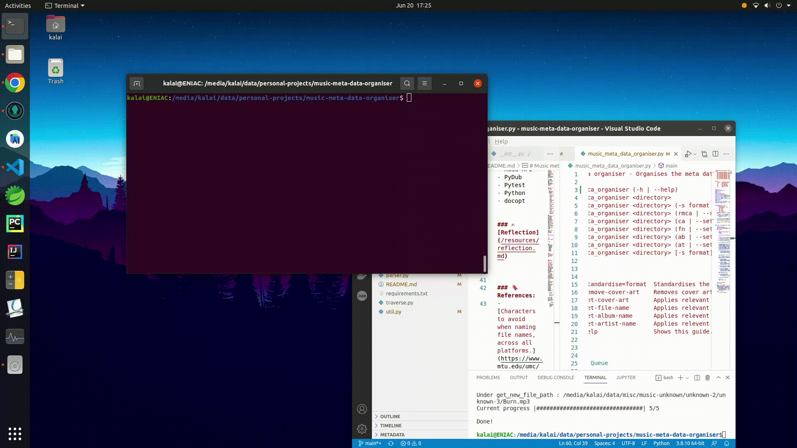

# Music meta-data organiser


A command line tool which cleans and organises the metadata of music files. 


## Table of Content:
  - [Table of Content:](#table-of-content)
    - [📜 Description:](#-description)
    - [🛠️ Tools Used:](#️-tools-used)
    - [🔖 References:](#-references)
    - [⚙️ Installation:](#️-installation)

### 📜 Description:
A command line tool which can standardise formats of music files, add meta data such as title, cover art and artist names to the music files, without any input.


<p align="center">
 
</p>
<p align="center">
<video width="75%" height="75%" controls="controls">
  <source src="resources/cmd-process.mp4"  type="video/mp4">
</video>
 </p>


[**User Story Map**](/resources/usm.svg)

### 🛠️ Tools Used:
- ShazamIO
- Mutagen
- Audd API
- PyDub
- Pytest
- Python
- docopt


### 🔖 References:
- [Characters to avoid when naming file names, across all platforms.](https://www.mtu.edu/umc/services/websites/writing/characters-avoid/)
- [Maximum file name size](https://mossgreen.github.io/filenames-that-cross-platforms/)

### ⚙️ Installation:
1) Having this repository's content as the root folder, install relevant python packages by running:
   
   ```pip3 install -r requirements.txt```

2) To find out on how to use this command line tool, run: 
   
    ```python3  music_meta_data_organiser.py -h```


